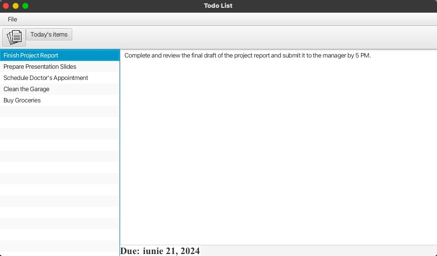
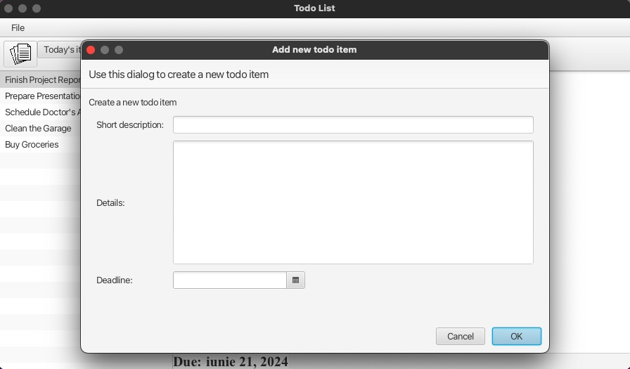

# TodoList - JavaFX Application

This is a basic JavaFX to-do list application, created to show my knowledge of JavaFx.

## Description

This application stores to-do items in a file and shows them.



The users can add a new to-do item and delete a to-do item. They can, also, view the items whose deadline is the current date.



## Installation

1. Clone this repository to your local machine:

 ``` shell
    https://github.com/marinescu97/TodoList.git
 ```

2. Run MainApplication.java file:
  - Open the project in your preferred Java IDE.
  - Run the `MainApplication.java` file located in the `src/main/java/com/marinescumonica/todolist` directory.
  - Follow the on-screen instructions to interact with the TodoList application.

## Technologies

- **Java 19**: Java 19 is the primary programming language, known for its strong performance and compatibility features. It ensures a reliable base for the app's backend logic and functions.
- **JavaFX**: JavaFX is used to create the dynamic and engaging user interface. It allows for the development of a responsive and visually attractive desktop app.

## License

The TodoList application is distributed under the [MIT License](https://opensource.org/license/mit).